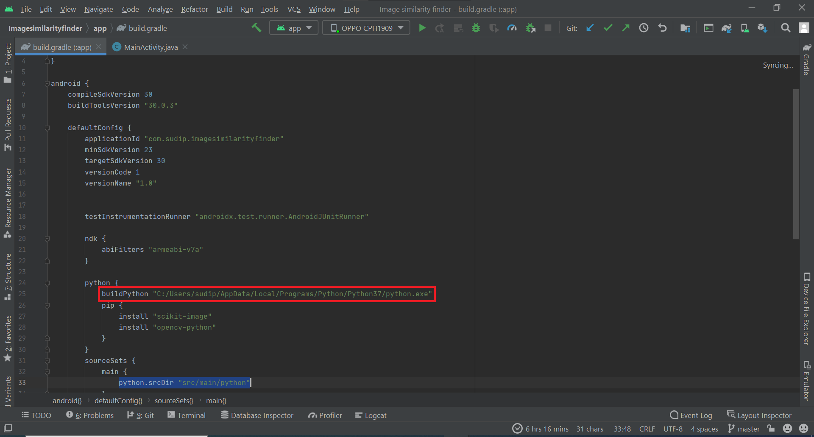
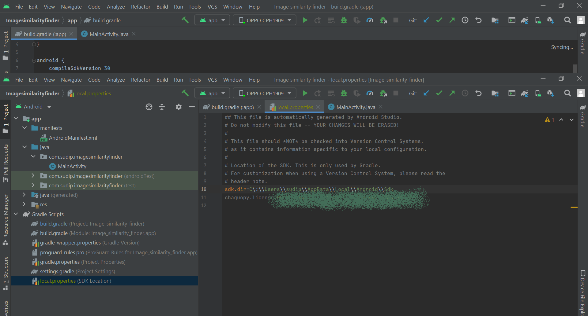

# Image-similarity-detector-android

Update your python filepath in the gradle files

 If you want to use emulator, you have to update the ABIs also ( line 21 of above image ) 

<h2> </h2>

 In the local properties, add the chaquopy license. If you don't have a license, don't worry, your app will work, showing some notifications stating that your app don't have a license of chaquopy

 For further information you may visit the official website of <a href="https://chaquo.com/chaquopy/"> chaquopy </a>

